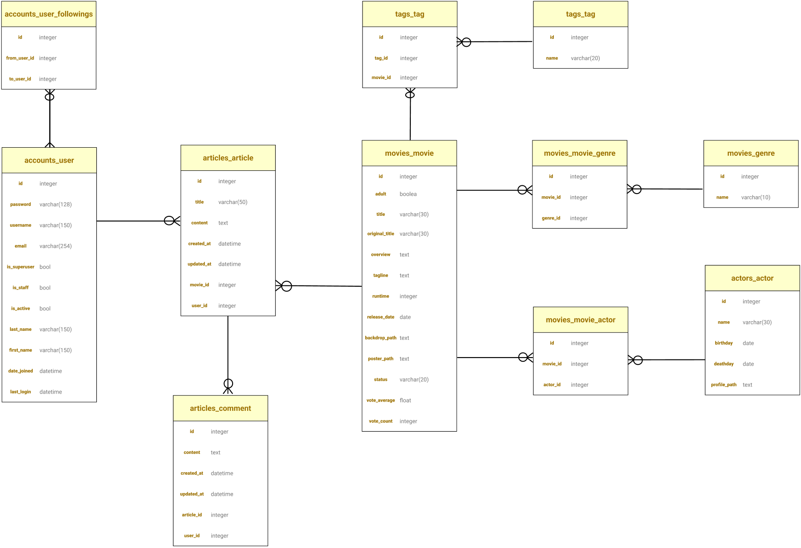
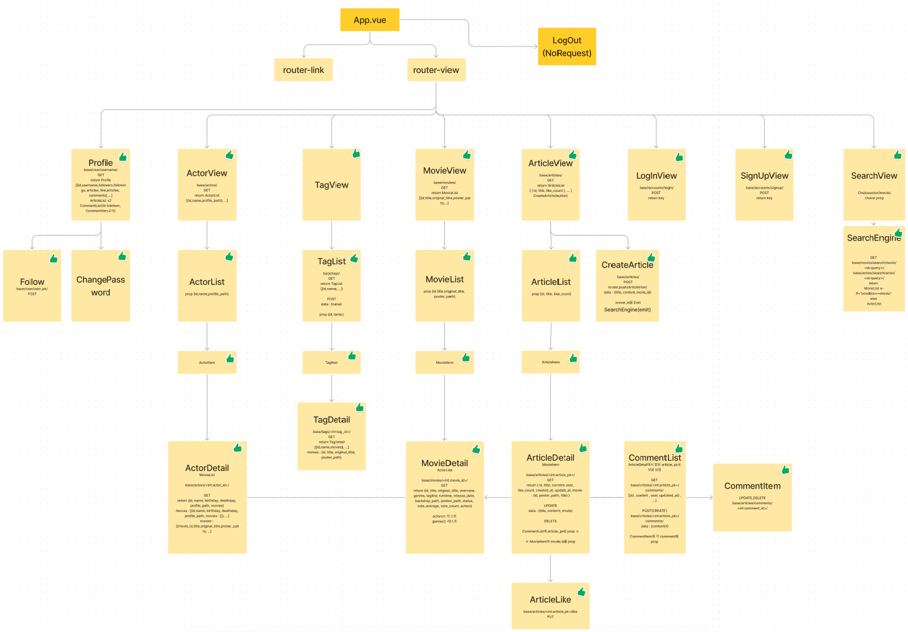

노션 https://www.notion.so/457b833544ec440fa9bdaabc4d65c4e1?v=9d89ef7f6fa54392bf4ff8f5a47fa41b
# README.md

1. 팀원 정보 및 업부 분담 내역
    - 팀장 : 안종상
        - 담당 업무
            - Django : Movie, Actor, Search, Recommandation
            - Vue : Django에서 담당한 앱
    - 팀원 : 박범진
        - 담당 업무
            - Django : Article, Comment, Profile, Account
            - Vue : Django에서 담당한 앱
            - CSS : font
2. 목표 서비스 구현 및 실제 구현 정도
    - TMDB에서 받은 영화 및 관련 정보 웹에서 제공
        - 각 컴포넌트에서 다른 컴포넌트로의 이동이 자유로워야함
    - 영화 추천
        - 추천 기능이 정말 유용한지 의문…
        - 유저가 유저에게 추천하는 시스템
            - 해쉬태그
        - 영화 제목을 가리고, 태그라인을 이용해서 영화를 선택
    - 커뮤니티 기능
        - 팔로우, 좋아요, 게시글, 댓글, 프로필
    - 회원 기능(가입, 로그인, 로그아웃, 비밀번호 변경)
        - dj-rest-auth의 기본 제공 기능 사용
    - 검색 기능
        - 영화 제목
            - 영화 제목은 기본은 한글이며, 영어 검색을 위해 original_title에서도 검색
        - 영화 배우
            - 배우의 경우, 한글로 표기된 배우와 영어로 표기된 배우가 있어, 검색 쿼리에 맞게 나온다.
    - 기능도 중요하지만, 유저가 느끼는 재미를 더 크게 생각함.
3. 데이터 베이스 모델링 (ERD)
    

5. 프론트 화면 구성
    
    
6. 영화 추천 알고리즘에 대한 기술적 설명
    - 영화와 태그가 N:M 관계
    - 한 유저가 태그를 만들면, 다른 유저가 해당 태그에 맞는 영화를 추가하는 시스템
    - 테마별 추천 기능과 유사
    - 너무 많은 태그가 생길 수 있지만, 일단 태그를 만들 수 있는 권한을 모든 유저에게 줌
7. 서비스 대표 기능에 대한 설명
    - 태그라인만 보고 영화를 선택하는 오락 기능
    - 태그를 이용해서 영화를 추천하는 기능
    - 영화 장르에 따라 배경이 바뀌는 기능
    - 프로필에서 사용자의 모든 기록들을 열람 및 수정, 이동 가능
    - 모든 컴포넌트에서 모든 컴포넌트로 끊김없이 이동 가능하다.
8. 느낀 점
    - 설계가 매우매우 중요하다.
        - 초기 설계를 오래 하지않고, 개발을 먼저 하다보니 문제가 발생하면 문제를 해결하는 데 시간이 오래 걸리고, 다른 설계에서도 영향을 미치게 된다.
        - 설계를 다시하고, 최대한 자세히 설계하면서 문제 발생도 현저히 줄었고, 개발 속도도 빨라졌다. 또한 협업에서 소통 오류로 인한 문제를 줄일 수 있었다.
    - 일일 보고를 통해 현재 진행도를 체크하면서 프로젝트를 진행하여, 전체적인 일정 조율
        - 우선적으로 해야할 일을 정해서 순서대로 프로젝트를 진행했고 , 밀리지 않고 시간내에 완성 할 수 있었음
9. 후기
    - 프로젝트 초기에 설계가 매우 중요하다.
    - Git 활용을 잘해야겠다.
        - 한번 충돌나서 다시 시작했다.
    - CSS의 꽃은 애니메이션
    - 서로 의견 충돌이 없어서 무사히 마쳤다.